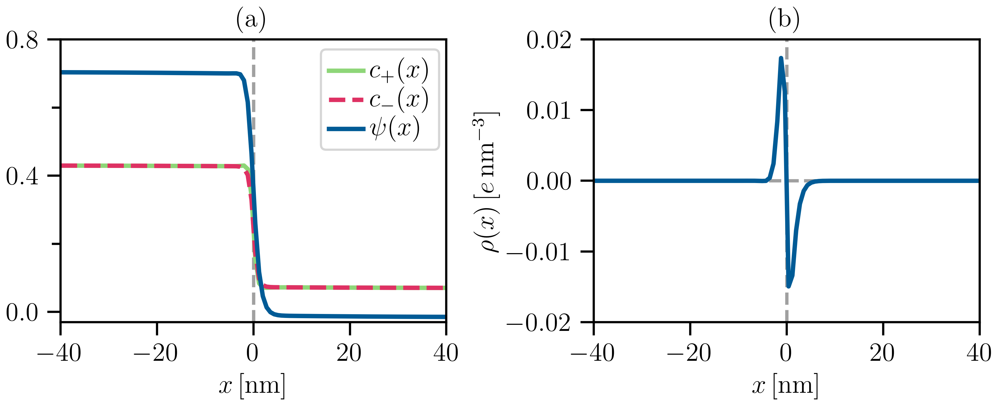

**The problem:**

Multi-component systems can often demix into phases rich in certain component(s) coexisting with dilute phases. The dynamics of such a phase separating system is typically described using Cahn-Hilliard type of mass conservation equations. In addition, when the components are charged, the system must also satisfy the Poisson equation at every time step. Here we study the dynamics of a phase separating system involving charged components in a one-dimensional (1D) geometry.

**What does the code do:**

The code solves mass-conservation equations

$$\nu_i\partial_t c_i=-\nabla\cdot j_i,$$ 

of the type of Cahn-Hilliard equations coupled with the Poisson equation 

$$\nabla\cdot\left(\varepsilon \, \nabla\psi\right) =-\rho$$ 

in a 1D set-up. The $i^{\mathrm{th}}$ component carries a molecular charge of $z_ie$, a molecular volume of $\nu_i$, and its concentration is given by $c_i(x)$. All the components together result in the local charge density 

$$\rho(x)=\sum\limits_i z_i e c_i(x).$$ 

The electrostatic potential $\psi(x)$ satisfies Dirichlet boundary conditions at the boundaries and a no-flux boundary condition is used for the concentration fields. The flux or the current $j_i$ of the $i^{\mathrm{th}}$ species is driven by the gradients in the electrochemical potential. The electrochemical potentials are calculated by describing the system using a Flory-Huggins description. For details of the model, please look at our published paper: [Phys. Rev. Research **6**, 033138 (2024)](https://doi.org/10.1103/PhysRevResearch.6.033138).

The code uses a combination of spectral, finite difference, and Runge-Kutta (RK4) methods to solve these coupled sets of equations for a system comprising 3 components (i.e., $i=3$): a positively charged component, a negatively charged, and a neutral one. The laplacian in the Poisson equation is calculated using spectral representation, where for the mass conservation equations, finite difference representation is used.

**Sample output:**

After compiling (e.g., using the command: g++ -lfftw3 -lm RK4.cpp -o RK4.out), the code can be run for the parameters mentioned in the code. It prints the output at certain time intervals which can be changed. So, in the end one has a series of data files giving the time evolution of the profiles. Once the program runs for a sufficiently long time, the profiles reach a steady state. The data for such steady-state profiles are provided in the 'data.txt' file. The following plots also show the profiles in the steady-state. As one can see in panel (a), the concentrations of both the positively (+) and negatively (-) charged components are higher in the left side denoting the dense phase. The dilute phase in the right side contains much less concentration of components. The electrostatic potential is set to zero in the dilute phase. But it also jumps across the interface to a high value in the dense phase. Panel (b) shows the existing charge density $\rho(x)= \left(z_+ e c_+(x) + z_- e c_-(x)\right)$ in the system. Clearly, the bulk of the two phases (dense and dilute) are charge-neutral ($\rho(x)=0$). But interestingly, around the interface one obtains non-zero charge densities implying that the dense phase carries a finite surface charge density accompanied by a layer of oppositely charged counter-ions forming a double-layer structure well-known in colloidal physics.

(a) Concentration fields $c_\pm(x)$ in the units of $\mathrm{nm}^{-3}$ and electrostatic potential $\psi(x)$ in the units of $k_BT/e$. (b) The resulting charge density $\rho(x)$.
